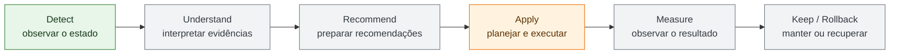
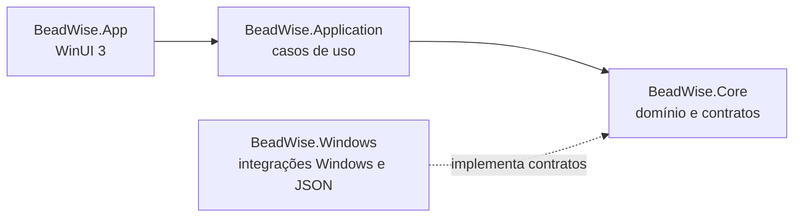

# BeadWise

O BeadWise é um projeto em desenvolvimento para diagnóstico e manutenção assistida de PCs Windows. A proposta é tornar mudanças no sistema mais compreensíveis e controladas: observar o estado, preparar um plano explícito e, quando aplicável, executar e verificar operações com atenção a risco e recuperação.

> **Status:** a base arquitetural e alguns fluxos de backend estão implementados; a interface e o conjunto completo de funcionalidades ainda estão em desenvolvimento. O projeto não deve ser tratado como um otimizador pronto para uso.

## Fluxo do produto

O fluxo orientador do BeadWise é **Detect → Understand → Recommend → Apply → Measure → Keep/Rollback**. Ele mostra como uma observação pode evoluir até uma mudança avaliada e mantida ou revertida.



<sub>Verde: observação de processos implementada. Laranja: execução experimental restrita a processos de teste controlados. Cinza: etapas da visão do produto ainda em desenvolvimento.</sub>

## O que já existe

- Observação de processos do Windows, incluindo identidade e disponibilidade dos dados coletados.
- Modelos de operações e planos que registram pré-condições, risco, privilégios, necessidade de reinicialização e reversibilidade.
- Validação estrutural de planos e um fluxo experimental de execução restrito a um processo de teste controlado.
- Criação e carregamento de sessões, com persistência local em arquivos JSON.
- Resultados e erros tipados para representar falhas, resultados parciais e capacidades indisponíveis.
- Testes automatizados para o domínio, os casos de uso e as integrações Windows cobertas pela solução.

Esses fluxos formam uma base técnica em evolução; não representam ainda uma experiência completa de diagnóstico, otimização ou recuperação para usuários finais.

## Stack

<p>
  
  
  
  
  
  
  
</p>

- **C# e .NET 10** para a aplicação e os projetos de backend.
- **WinUI 3 e Windows App SDK** para a futura interface desktop.
- **xUnit** para testes automatizados.
- **System.Text.Json** para serialização das sessões locais.
- **Git** para versionamento.

## Executar localmente

O desenvolvimento e os projetos Windows devem ser compilados em uma máquina Windows. Instale o [.NET 10 SDK](https://dotnet.microsoft.com/download/dotnet/10.0); o projeto desktop usa o Windows App SDK e tem como alvo o Windows 10, versão 1809 ou posterior.

```powershell
git clone https://github.com/MiguelZGobbo/beadwise.git
cd beadwise
dotnet restore BeadWise.sln
dotnet build BeadWise.sln
dotnet test BeadWise.sln
```

Não há configuração `.env`, banco de dados ou serviços externos necessários. A interface WinUI ainda não contém um fluxo funcional conectado aos casos de uso; por enquanto, a forma prática de validar o projeto é compilar a solução e executar os testes.

## Arquitetura

A solução separa regras e contratos de detalhes do Windows, mantendo os casos de uso testáveis sem depender da interface:



- **`BeadWise.Core`** — conceitos de domínio, contratos, planos, operações, observações, sessões e resultados.
- **`BeadWise.Application`** — casos de uso que coordenam observação, planejamento, execução e sessões.
- **`BeadWise.Windows`** — adaptadores para recursos do Windows e persistência local de sessões em JSON.
- **`BeadWise.App`** — ponto de entrada desktop baseado em WinUI 3; a interface está em estágio inicial.

A persistência atual é local, por arquivo; ainda não há banco de dados nem migrations. A direção do produto é estruturada em etapas de descoberta, especificação, prototipagem e implementação incremental.

## Testes

Execute todos os projetos de teste da solução com:

```powershell
dotnet test BeadWise.sln
```

Os testes cobrem regras de domínio, validação de planos, casos de uso, persistência e carregamento de sessões, observação de processos e ações sobre processos de teste controlados. As operações de teste usam uma fixture dedicada; os testes não constituem validação de alterações gerais em máquinas de usuários.

## Estrutura do repositório

```text
BeadWise.sln
src/
  BeadWise.App/             # Aplicação desktop WinUI 3
  BeadWise.Application/     # Casos de uso
  BeadWise.Core/            # Domínio e contratos
  BeadWise.Windows/         # Integrações e persistência Windows
tests/
  BeadWise.Core.Tests/
  BeadWise.Application.Tests/
  BeadWise.Windows.Tests/
  BeadWise.ControlledProcessFixture/
docs/                       # Arquitetura, decisões e estratégia de testes
discovery/                  # Pesquisa por domínio
feature-specs/              # Especificações de funcionalidades
prototypes/                 # Provas técnicas e seus resultados
```

## Decisões técnicas

- **Separar domínio, casos de uso e integrações Windows:** mantém regras testáveis e evita que a interface dependa diretamente de APIs do sistema.
- **Planejar mudanças antes de executá-las:** operações carregam informações de risco, pré-condições, privilégios e reversibilidade para apoiar revisão e validação.
- **Persistir sessões em JSON local nesta etapa:** permite desenvolver o fluxo de sessões sem introduzir infraestrutura de banco antes de ela ser necessária.
- **Usar processos de teste controlados para validar execução:** permite exercitar o fluxo de ação sem direcioná-lo a processos arbitrários do usuário.

## Documentação do projeto

- [Arquitetura consolidada](docs/03A-ARCHITECTURE-FINAL.md)
- [Registro de decisões](docs/06-DECISIONS.md)
- [Estratégia de testes](docs/05-TESTING-STRATEGY.md)
- [Plano do projeto](docs/00-PROJECT-PLAN.md)

Não há badge de CI nesta README porque o repositório ainda não contém um workflow de integração contínua.
